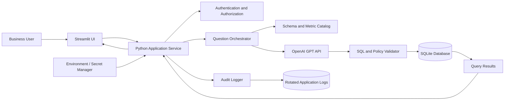
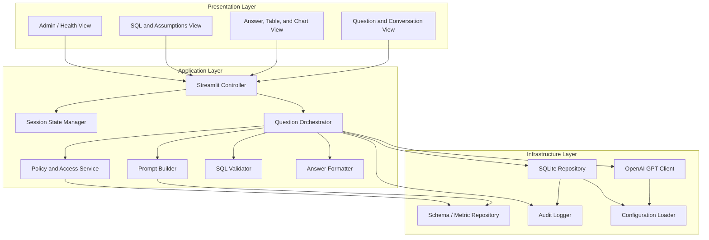
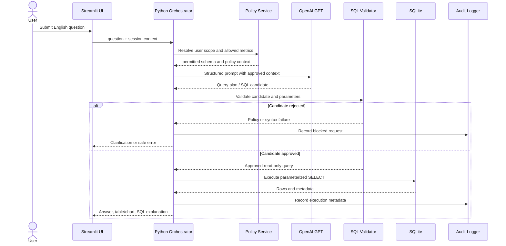

# Product Requirements Document

## InsightSQL - AI Powered Workforce Analytics Assistant

**Document status:** Draft
**Product owner:** Product Management
**Target release:** MVP

## 1. Executive Summary

InsightSQL is an AI-powered workforce analytics assistant that enables business stakeholders to ask questions about organizational data in plain English and receive understandable, trustworthy answers. The assistant translates a user's question into SQL, executes the query against approved databases, and presents the result with context about the data used.

The product addresses a common analytics bottleneck: stakeholders need timely answers from databases but do not know SQL or cannot depend on an analyst for every question. InsightSQL will reduce time to insight while preserving security, data governance, and human confidence through query transparency, access controls, validation, and clear handling of ambiguous or unsupported requests.

The MVP will support read-only workforce analytics against configured data sources. It will not modify data, make employment decisions, or replace expert review for sensitive or high-impact analysis.

## 2. Business Objectives

1. **Reduce time to answers:** Enable stakeholders to obtain routine workforce metrics in minutes rather than waiting for manual query creation.
2. **Expand data access:** Make approved database insights available to non-technical users through natural-language interaction.
3. **Improve analyst leverage:** Reduce repetitive ad hoc SQL requests so analysts can focus on higher-value analysis and data products.
4. **Increase trust in self-service analytics:** Show the generated SQL, data source, filters, assumptions, and result limitations for every answer.
5. **Protect sensitive workforce data:** Enforce user permissions, minimize exposure of personal data, and maintain an auditable record of activity.

**Initial success measures**

- At least 70% of supported MVP questions produce a useful answer without analyst intervention during pilot evaluation.
- Median time from question submission to answer is under 10 seconds for standard queries.
- At least 80% of pilot users report that answers are understandable and actionable.
- 100% of executed queries are attributable to a user and recorded in the audit log.
- Zero unauthorized data access incidents during the pilot.

## 3. Stakeholders

| Stakeholder | Need / responsibility |
|---|---|
| Business stakeholders | Ask questions and use workforce insights for planning and operations. |
| HR and People Analytics | Define trusted metrics, validate answers, and govern sensitive workforce data. |
| Executive leadership | Consume high-level workforce trends and monitor business outcomes. |
| Data analysts | Validate semantic mappings, investigate issues, and handle complex requests. |
| Data engineering | Configure data sources, schemas, performance, and reliability. |
| Information security | Review access controls, data handling, threat model, and auditability. |
| Legal, privacy, and compliance | Define permitted use of employee data and retention requirements. |
| IT / platform operations | Manage deployment, integrations, availability, and support. |
| Product management | Own product scope, prioritization, adoption, and measurable outcomes. |

## 4. Functional Requirements

### 4.1 Natural-language questions

- Users must be able to submit workforce analytics questions in plain English.
- The assistant must support follow-up questions that retain relevant conversation context.
- The assistant must provide example questions based on the user's permitted data and common workforce metrics.
- The assistant must identify ambiguous terms, missing information, and unsupported requests before executing a query.

### 4.2 Question understanding and SQL generation

- The system must translate supported natural-language questions into SQL using approved schemas, metric definitions, and business terminology.
- The system must use the user's permissions when generating and executing a query.
- The system must validate generated SQL before execution for syntax, read-only behavior, permitted tables and columns, and potentially unsafe query patterns.
- The system must prevent write operations such as `INSERT`, `UPDATE`, `DELETE`, `DROP`, and schema changes.
- The system should offer the user a clarification step when more than one reasonable interpretation exists.

### 4.3 Query execution and results

- The system must execute queries only against registered, approved data sources.
- The system must return tabular results for supported questions.
- The system should provide suitable visualizations for common trends, comparisons, distributions, and rankings.
- The system must display the data source, applied filters, time period, row limits, and relevant assumptions.
- The system must handle empty results, timeouts, invalid queries, and unavailable data sources with actionable messages.
- The system must support export of authorized results in a controlled format such as CSV.

### 4.4 Trust, governance, and audit

- The system must show the generated SQL or an equivalent query explanation for each executed request.
- Users must be able to provide feedback on whether an answer was useful or incorrect.
- The system must log the user, timestamp, natural-language question, generated query, data source, execution outcome, and feedback metadata.
- The system must apply masking, aggregation, or refusal rules for restricted personally identifiable or sensitive employee data.
- The system must provide an administrator view or configuration mechanism for data sources, metric definitions, approved schemas, and access policies.

### 4.5 Administration and support

- Administrators must be able to enable or disable a data source without redeploying the application.
- Administrators must be able to manage user roles and access scopes through the organization's identity provider or configured role model.
- Support users must be able to review failed requests and relevant diagnostic metadata without exposing restricted result data.

### 4.6 MVP boundaries

- Read-only workforce analytics only.
- English-language questions only.
- Registered relational databases only.
- No automated hiring, firing, promotion, compensation, or employee performance decisions.
- No unrestricted access to raw employee records.

## 5. Non Functional Requirements

### Security and privacy

- All access must require authenticated users through the organization's approved identity mechanism.
- Authorization must be enforced at the application and data-source layers where supported.
- Data must be encrypted in transit and at rest according to organizational standards.
- Secrets and database credentials must never be stored in source code, prompts, logs, or client-side code.
- Logs must avoid storing unnecessary sensitive result data and must follow approved retention policies.
- The product must support privacy review and documented data classification before production use.

### Performance and scalability

- Standard queries should return an initial response within 10 seconds at the 50th percentile and within 30 seconds at the 95th percentile under expected pilot load.
- Query execution must use configurable timeouts, row limits, and resource controls.
- The architecture should support horizontal scaling of the application layer without requiring user-visible changes.

### Reliability and availability

- The service should achieve 99.5% monthly availability during the pilot, excluding approved maintenance.
- A failed model response or data-source outage must not expose partial or fabricated results.
- The system must provide monitoring, alerting, structured logs, and recovery procedures.

### Accuracy and explainability

- Generated SQL must be validated before execution.
- Answers must distinguish returned facts from assumptions, estimates, and unavailable information.
- Metric definitions and semantic mappings must be versioned and reviewable.
- The system must be evaluated for accuracy across representative workforce question sets before release.

### Usability and accessibility

- A first-time user must be able to submit a supported question without SQL knowledge or training.
- Results and error messages must use plain, business-friendly language.
- The interface must support keyboard navigation and meet the organization's applicable accessibility standard, targeted at WCAG 2.1 AA.
- The experience must work on supported desktop browsers and adapt to common laptop screen sizes.

### Maintainability and compliance

- The system must separate model orchestration, semantic definitions, query validation, data access, and presentation layers.
- Configuration changes must be traceable and reversible.
- Operational and security documentation must be available before production launch.

## 6. User Stories

1. As a business stakeholder, I want to ask a workforce question in English so that I can get an answer without writing SQL.
2. As a business stakeholder, I want to ask a follow-up question so that I can refine the analysis without restating all context.
3. As a business stakeholder, I want to see the filters and time period used so that I can judge whether the answer matches my intent.
4. As a business stakeholder, I want to see a chart or table appropriate to my question so that I can understand the result quickly.
5. As a business stakeholder, I want to export an authorized result so that I can use it in a meeting or planning workflow.
6. As an analyst, I want to review the generated SQL so that I can validate and reproduce an answer.
7. As an analyst, I want to define trusted workforce metrics so that common terms produce consistent results.
8. As a data administrator, I want to register approved data sources and schemas so that the assistant operates within governed boundaries.
9. As a security administrator, I want permissions and audit logs so that access to workforce data is controlled and reviewable.
10. As a user, I want the assistant to ask for clarification when my question is ambiguous so that I do not receive a misleading answer.

## 7. Acceptance Criteria

### MVP release criteria

- Given an authenticated user with access to an approved workforce dataset, when they submit a supported English question, then the system generates and executes a read-only query and displays the result.
- Given a question requiring unavailable or unauthorized data, when the user submits it, then the system refuses or explains the limitation without revealing restricted data.
- Given a generated query containing a write operation or unauthorized object, when validation runs, then execution is blocked and the event is logged.
- Given an ambiguous question, when the system detects multiple valid interpretations, then it asks a clarifying question before executing.
- Given a successful answer, then the interface displays the natural-language answer, result table or visualization, data source, filters, time period, assumptions, and generated SQL or equivalent explanation.
- Given zero matching records, then the system clearly states that no records matched and does not imply that data is missing or that the count is zero unless that is what the query establishes.
- Given a database timeout or service failure, then the user receives a clear retry or support action and no fabricated result is shown.
- Given any executed or blocked request, then the audit log records the user, timestamp, request, query status, data source, and relevant policy outcome.
- Given a user attempts to export data, then the export contains only data the user is authorized to access and respects configured row and masking rules.
- Given pilot evaluation questions representing agreed supported use cases, then the product meets the agreed accuracy threshold and has documented failures and known limitations.

### Launch readiness criteria

- Security, privacy, and compliance reviews are completed with no unresolved critical findings.
- Representative data-source performance and failure tests pass.
- Monitoring, alerting, support ownership, and incident procedures are documented.
- User acceptance testing is completed by business stakeholders and analysts.
- Metric definitions, access policies, and data-source ownership are documented.

## 8. Project Risks

| Risk | Impact | Mitigation |
|---|---|---|
| Incorrect SQL or misunderstood questions | Users may act on inaccurate insights. | Use governed semantic definitions, query validation, clarification flows, evaluation datasets, and visible assumptions. |
| Unauthorized access to employee data | Privacy, legal, and reputational harm. | Enforce authentication and authorization, masking and aggregation policies, least privilege, audit logs, and privacy review. |
| Hallucinated or fabricated answers | Loss of trust and poor decisions. | Ground responses in query results, refuse when data is unavailable, and never synthesize unsupported facts. |
| Inconsistent metric definitions | Different teams may receive conflicting answers. | Establish metric ownership, a governed metric catalog, and versioned definitions. |
| Slow or expensive queries | Poor adoption and unexpected infrastructure cost. | Apply query limits, timeouts, caching where appropriate, workload monitoring, and cost budgets. |
| Poor source-data quality | Results may be technically correct but misleading. | Surface data freshness and quality indicators and assign data owners for remediation. |
| Prompt injection or malicious query content | Bypass attempts or unsafe behavior. | Treat database content as untrusted, isolate system instructions, validate SQL independently, and apply allowlists. |
| Overreliance on automated insights | Users may use outputs for prohibited employment decisions. | Add acceptable-use policy, warnings for sensitive use cases, access controls, and human review requirements. |
| Vendor or model dependency | Availability, pricing, or behavior changes may affect the product. | Abstract model providers, monitor quality, maintain fallback behavior, and review provider terms. |
| Low user adoption | Business value may not materialize. | Pilot with high-value use cases, provide examples, collect feedback, and iterate on terminology and UX. |

## 9. Future Enhancements

- Support additional languages and organization-specific terminology.
- Add governed dashboards, saved questions, scheduled reports, and subscriptions.
- Support richer analytical workflows such as cohort analysis, drill-downs, forecasting, and anomaly detection.
- Add semantic-layer management with metric lineage, ownership, certification, and approval workflows.
- Integrate with collaboration tools such as Microsoft Teams, Slack, and email.
- Add role-aware summaries for executives, HR partners, managers, and analysts.
- Support additional data platforms, data warehouses, APIs, and non-relational sources where governance permits.
- Add data freshness, quality, lineage, and source-health indicators directly to answers.
- Provide analyst correction workflows that improve mappings and reusable query templates without learning from restricted data.
- Add stronger evaluation tooling for accuracy, fairness, bias, explainability, and regression monitoring.
- Enable controlled natural-language generation of recurring insight narratives, subject to review and approval.

## 10. Principal Software Architecture

### 10.1 Architecture Overview

InsightSQL is a single-user-session, server-side Streamlit application. Streamlit provides the presentation and interaction layer; Python owns orchestration, validation, business rules, and persistence; SQLite stores the approved workforce schema and audit metadata; and OpenAI GPT translates natural-language questions into structured query plans or SQL explanations.

The architecture uses a guarded, read-only query path:

1. Accept a user's question through Streamlit.
2. Load only the schema and metric definitions permitted for the session.
3. Ask GPT for a structured query plan or SQL candidate using a constrained prompt.
4. Validate the candidate with an independent SQL policy layer.
5. Execute only approved read-only SQL against SQLite using parameterized values.
6. Return rows and metadata to the application, then render a plain-language answer and visualization.
7. Record an audit event without storing unnecessary sensitive result data.

The application must never allow GPT to execute SQL directly, write to SQLite, choose credentials, or bypass authorization and policy validation.

### 10.2 Architecture Diagram



**Deployment boundary:** Streamlit, Python services, SQLite, and logs run inside the controlled application environment. Only the GPT API call crosses the external service boundary. Database files, prompts containing schema metadata, and result data must be handled according to the organization's privacy policy.

### 10.3 Component Diagram



**Component responsibilities**

- **Streamlit Controller:** Converts widget events into application commands and renders view models. It must not contain SQL or provider-specific business logic.
- **Session State Manager:** Keeps conversation context, request identifiers, and transient results scoped to the current user session; it must not be treated as a durable store.
- **Question Orchestrator:** Coordinates intent extraction, policy evaluation, query validation, execution, formatting, and failure handling.
- **Prompt Builder:** Supplies only approved schema and metric context and requests a strict structured response from GPT.
- **Policy and Access Service:** Applies user permissions, sensitive-field rules, row limits, and allowed-table policies.
- **SQL Validator:** Parses or statically checks SQL, rejects writes and multiple statements, enforces allowlists, and requires parameterized inputs.
- **SQLite Repository:** Owns connections, transactions, read-only execution, parameter binding, timeout behavior, and row limits.
- **OpenAI GPT Client:** Encapsulates API calls, model configuration, retries, timeouts, token limits, and provider errors.
- **Answer Formatter:** Produces a factual answer from database results and clearly labels assumptions, empty results, and limitations.
- **Audit Logger:** Emits structured security and operational events with correlation IDs.

### 10.4 Data Flow Diagram



**Data-flow controls**

- Conversation context is minimized before it is sent to GPT.
- Raw employee PII must be excluded from prompts unless explicitly approved and required.
- SQL is validated independently after GPT returns it.
- SQLite receives parameterized values and read-only statements only.
- Results are filtered and masked before rendering or export.
- Logs contain metadata and hashes or request IDs where possible, not full sensitive result sets.

### 10.5 Folder Structure

```text
InsightSQL/
|-- app.py                         # Streamlit entry point
|-- pyproject.toml                 # Dependencies, tooling, and project metadata
|-- requirements.txt               # Optional deployment dependency lock list
|-- README.md
|-- .env.example                   # Variable names only; no secrets
|-- .gitignore
|-- data/
|   |-- .gitkeep
|   `-- insightsql.db              # Runtime-created SQLite file, excluded from Git
|-- src/
|   |-- config.py                  # Typed application configuration
|   |-- auth.py                    # Authentication and authorization adapter
|   |-- models.py                  # Domain and request/response models
|   |-- prompts.py                 # Versioned prompt templates
|   |-- orchestrator.py            # End-to-end question workflow
|   |-- policy.py                  # Access, PII, and query policies
|   |-- sql_validator.py            # Read-only SQL validation
|   |-- answer_formatter.py         # Grounded answer and visualization model
|   |-- db/
|   |   |-- connection.py           # SQLite connection factory and pragmas
|   |   |-- repository.py            # Parameterized query execution
|   |   |-- schema.sql               # Database DDL
|   |   `-- seed.sql                 # Development/sample data
|   |-- integrations/
|   |   `-- openai_client.py         # OpenAI API adapter
|   `-- observability/
|       |-- logging.py               # Structured logging and redaction
|       `-- metrics.py               # Latency, errors, and usage metrics
|-- tests/
|   |-- unit/
|   |   |-- test_sql_validator.py
|   |   |-- test_policy.py
|   |   `-- test_answer_formatter.py
|   |-- integration/
|   |   |-- test_repository.py
|   |   `-- test_orchestrator.py
|   |-- fixtures/
|   |   `-- database.py
|   `-- conftest.py
|-- scripts/
|   |-- init_db.py
|   `-- evaluate_questions.py
`-- logs/                           # Local development only; excluded from Git
```

### 10.6 Security Strategy

#### Identity and authorization

- Require authenticated access through the organization's identity provider before showing workforce data.
- Derive the user's role and department scope from trusted identity claims; do not accept authorization values from UI fields or GPT.
- Apply least privilege to application and database access.
- Use separate application, administrator, and test identities where operationally possible.

#### Database and query security

- Open SQLite in read-only mode for the query path where the deployment model permits it.
- Keep schema migrations and seed operations in a separate administrative path.
- Allowlist tables, columns, functions, and query shapes required for supported analytics.
- Reject write statements, multiple statements, comments used for obfuscation, unsupported functions, unrestricted joins, and queries without enforced limits.
- Bind all user-derived values as parameters; never concatenate user input into SQL.
- Protect the database file and backups with operating-system permissions and encryption at rest.

#### AI-specific controls

- Treat user input and database content as untrusted prompt content.
- Use a fixed system prompt, explicit output schema, and a small approved schema/metric context.
- Never place API keys in prompts, source code, Streamlit widgets, logs, or the repository.
- Configure model temperature, token limits, request timeouts, and provider retry limits explicitly.
- Do not use model output as an authorization decision; enforce policy in Python.
- Redact or aggregate sensitive employee fields before output and refuse prohibited individual-level requests.

#### Secrets, privacy, and operations

- Load `OPENAI_API_KEY` and database configuration from environment variables or a secret manager.
- Maintain `.env.example` with names only and add database files, logs, and local secrets to `.gitignore`.
- Use TLS for provider calls and restrict outbound network access to required services.
- Define retention and deletion rules for questions, audit records, traces, and exported files.
- Run dependency, static, secret, and vulnerability scans in CI.

### 10.7 Logging Strategy

Use Python's structured logging with JSON output in deployed environments and human-readable output for local development. Every request receives a correlation ID and a session-scoped request ID.

**Recommended event fields**

- `timestamp`, `level`, `event_name`, `correlation_id`, `session_id_hash`
- `user_id_hash`, `role`, `request_type`, `data_source`
- `model_name`, `prompt_version`, `query_fingerprint`
- `latency_ms`, `row_count`, `status`, `error_code`
- `policy_decision`, `validation_decision`, `application_version`

**Events and levels**

- `INFO`: request received, validation passed, query completed, answer rendered.
- `WARNING`: clarification required, query rejected by policy, provider retry, slow query, empty result.
- `ERROR`: database failure, provider failure, unexpected application exception, failed export.
- `SECURITY`: authentication failure, authorization denial, prompt-injection signal, blocked write attempt.

Never log API keys, access tokens, raw employee PII, full result sets, or unredacted prompts. Store query fingerprints and redacted SQL where troubleshooting requires it. Forward logs to centralized monitoring in production, apply retention limits, and alert on elevated authorization denials, failed validations, provider errors, and latency thresholds.

### 10.8 Exception Handling Strategy

Use explicit exception types and translate them at the application boundary into safe user-facing messages. Internal logs should contain the exception type, correlation ID, and sanitized diagnostic context.

| Exception category | Application behavior | User message |
|---|---|---|
| Invalid or ambiguous question | Do not call SQLite; request clarification or explain supported scope. | "Please clarify the metric, time period, or department." |
| GPT timeout, rate limit, or provider failure | Retry only transient failures with bounded exponential backoff; otherwise fail closed. | "The assistant is temporarily unavailable. Try again shortly." |
| Invalid model response | Reject schema-invalid output and optionally perform one bounded repair request. | "I could not safely interpret that request." |
| SQL validation failure | Do not execute; log policy outcome and return a safe explanation. | "That request cannot be run under the current data-access policy." |
| SQLite connection or query failure | Roll back any transaction, close the connection, log details, and avoid partial answers. | "The data source could not complete this request." |
| Unauthorized data request | Do not reveal whether restricted records exist. | "You do not have access to that information." |
| Export or rendering failure | Keep the on-screen result if safe and offer a retry; never create a partial export. | "The result could not be exported." |
| Unexpected exception | Catch at the Streamlit boundary, generate a correlation ID, log the traceback securely, and fail closed. | "Something went wrong. Contact support with the request ID." |

Implementation rules:

- Catch specific exceptions before a final generic handler.
- Use context managers for SQLite connections and cursors.
- Roll back writes in administrative paths; the analytics path should use read-only transactions.
- Use timeouts for GPT calls and database operations.
- Do not expose stack traces, SQL internals, provider responses, or secrets to users.
- Preserve the original exception as a chained cause for diagnostics.
- Ensure every error response is represented by a structured audit or operational event.

### 10.9 Testing Strategy

#### Unit testing with Pytest

- Test SQL validation for allowed `SELECT` statements, rejected writes, multiple statements, disallowed tables, unsafe functions, comments, and missing limits.
- Test policy decisions for roles, department scope, PII masking, aggregation thresholds, export permissions, and denied requests.
- Test prompt construction for schema minimization, prompt-version selection, and absence of secrets.
- Test answer formatting for normal results, empty results, nulls, totals, assumptions, and unsupported claims.
- Test configuration validation and redaction utilities.

#### Integration testing

- Run repository tests against a temporary SQLite database created from the real schema and seed fixtures.
- Test the complete orchestrator with a mocked OpenAI client and deterministic model responses.
- Test transaction, timeout, connection-close, migration, and rollback behavior.
- Test Streamlit-facing command paths without requiring a live external provider.

#### Contract and provider testing

- Validate OpenAI responses against a strict structured-output schema.
- Maintain a small opt-in provider contract suite for model/API changes; never require live API calls for the default CI suite.
- Use recorded or stubbed responses for deterministic regression tests and redact any captured data.

#### Evaluation and security testing

- Maintain a representative question set covering department counts, headcount trends, project allocation, active projects, and denied sensitive requests.
- Measure SQL validity, answer correctness, clarification rate, latency, token usage, and refusal accuracy.
- Test prompt injection, data exfiltration attempts, authorization bypass, SQL injection, denial-of-service query shapes, and sensitive-field leakage.
- Test that unsupported questions fail safely rather than producing fabricated answers.

#### Quality gates

- Run `pytest` with coverage reporting on every pull request.
- Require unit and integration tests to pass before merge.
- Set a minimum coverage target for policy, validation, repository, and orchestration modules, with risk-based review for exceptions.
- Add linting, type checking, dependency scanning, secret scanning, and `git diff --check` to CI.
- Run performance tests against realistic SQLite data volumes before release.
