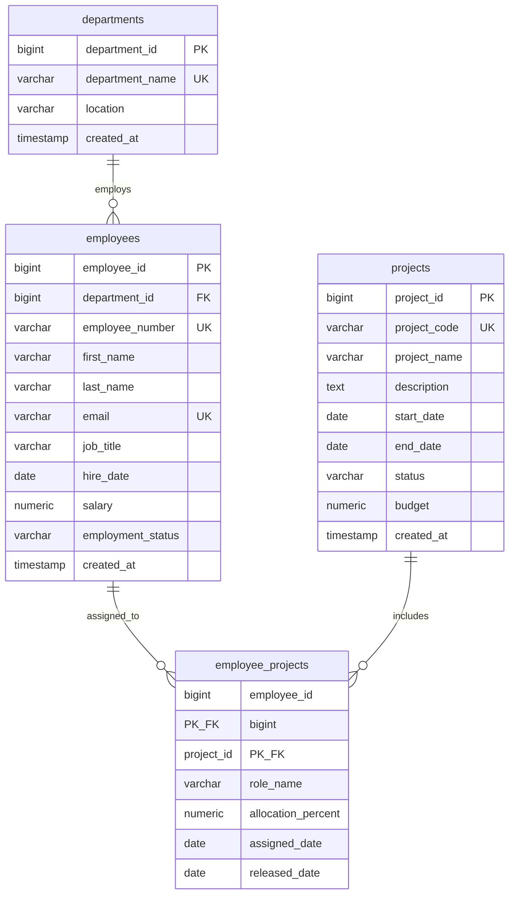

# Project Discovery Document

## InsightSQL - AI Powered Workforce Analytics Assistant

**Document status:** Draft
**Product owner:** Product Management
**Target release:** MVP

## 1. Executive Summary

InsightSQL is an AI-powered workforce analytics assistant that enables business stakeholders to ask questions about organizational data in plain English and receive understandable, trustworthy answers. The assistant translates a user's question into SQL, executes the query against approved databases, and presents the result with context about the data used.

The product addresses a common analytics bottleneck: stakeholders need timely answers from databases but do not know SQL or cannot depend on an analyst for every question. InsightSQL will reduce time to insight while preserving security, data governance, and human confidence through query transparency, access controls, validation, and clear handling of ambiguous or unsupported requests.

The MVP will support read-only workforce analytics against configured data sources. It will not modify data, make employment decisions, or replace expert review for sensitive or high-impact analysis.

## 2. Business Objectives

1. **Reduce time to answers:** Enable stakeholders to obtain routine workforce metrics in minutes rather than waiting for manual query creation.
2. **Expand data access:** Make approved database insights available to non-technical users through natural-language interaction.
3. **Improve analyst leverage:** Reduce repetitive ad hoc SQL requests so analysts can focus on higher-value analysis and data products.
4. **Increase trust in self-service analytics:** Show the generated SQL, data source, filters, assumptions, and result limitations for every answer.
5. **Protect sensitive workforce data:** Enforce user permissions, minimize exposure of personal data, and maintain an auditable record of activity.

**Initial success measures**

- At least 70% of supported MVP questions produce a useful answer without analyst intervention during pilot evaluation.
- Median time from question submission to answer is under 10 seconds for standard queries.
- At least 80% of pilot users report that answers are understandable and actionable.
- 100% of executed queries are attributable to a user and recorded in the audit log.
- Zero unauthorized data access incidents during the pilot.

## 3. Stakeholders

| Stakeholder | Need / responsibility |
|---|---|
| Business stakeholders | Ask questions and use workforce insights for planning and operations. |
| HR and People Analytics | Define trusted metrics, validate answers, and govern sensitive workforce data. |
| Executive leadership | Consume high-level workforce trends and monitor business outcomes. |
| Data analysts | Validate semantic mappings, investigate issues, and handle complex requests. |
| Data engineering | Configure data sources, schemas, performance, and reliability. |
| Information security | Review access controls, data handling, threat model, and auditability. |
| Legal, privacy, and compliance | Define permitted use of employee data and retention requirements. |
| IT / platform operations | Manage deployment, integrations, availability, and support. |
| Product management | Own product scope, prioritization, adoption, and measurable outcomes. |

## 4. Functional Requirements

### 4.1 Natural-language questions

- Users must be able to submit workforce analytics questions in plain English.
- The assistant must support follow-up questions that retain relevant conversation context.
- The assistant must provide example questions based on the user's permitted data and common workforce metrics.
- The assistant must identify ambiguous terms, missing information, and unsupported requests before executing a query.

### 4.2 Question understanding and SQL generation

- The system must translate supported natural-language questions into SQL using approved schemas, metric definitions, and business terminology.
- The system must use the user's permissions when generating and executing a query.
- The system must validate generated SQL before execution for syntax, read-only behavior, permitted tables and columns, and potentially unsafe query patterns.
- The system must prevent write operations such as `INSERT`, `UPDATE`, `DELETE`, `DROP`, and schema changes.
- The system should offer the user a clarification step when more than one reasonable interpretation exists.

### 4.3 Query execution and results

- The system must execute queries only against registered, approved data sources.
- The system must return tabular results for supported questions.
- The system should provide suitable visualizations for common trends, comparisons, distributions, and rankings.
- The system must display the data source, applied filters, time period, row limits, and relevant assumptions.
- The system must handle empty results, timeouts, invalid queries, and unavailable data sources with actionable messages.
- The system must support export of authorized results in a controlled format such as CSV.

### 4.4 Trust, governance, and audit

- The system must show the generated SQL or an equivalent query explanation for each executed request.
- Users must be able to provide feedback on whether an answer was useful or incorrect.
- The system must log the user, timestamp, natural-language question, generated query, data source, execution outcome, and feedback metadata.
- The system must apply masking, aggregation, or refusal rules for restricted personally identifiable or sensitive employee data.
- The system must provide an administrator view or configuration mechanism for data sources, metric definitions, approved schemas, and access policies.

### 4.5 Administration and support

- Administrators must be able to enable or disable a data source without redeploying the application.
- Administrators must be able to manage user roles and access scopes through the organization's identity provider or configured role model.
- Support users must be able to review failed requests and relevant diagnostic metadata without exposing restricted result data.

### 4.6 MVP boundaries

- Read-only workforce analytics only.
- English-language questions only.
- Registered relational databases only.
- No automated hiring, firing, promotion, compensation, or employee performance decisions.
- No unrestricted access to raw employee records.

## 5. Non Functional Requirements

### Security and privacy

- All access must require authenticated users through the organization's approved identity mechanism.
- Authorization must be enforced at the application and data-source layers where supported.
- Data must be encrypted in transit and at rest according to organizational standards.
- Secrets and database credentials must never be stored in source code, prompts, logs, or client-side code.
- Logs must avoid storing unnecessary sensitive result data and must follow approved retention policies.
- The product must support privacy review and documented data classification before production use.

### Performance and scalability

- Standard queries should return an initial response within 10 seconds at the 50th percentile and within 30 seconds at the 95th percentile under expected pilot load.
- Query execution must use configurable timeouts, row limits, and resource controls.
- The architecture should support horizontal scaling of the application layer without requiring user-visible changes.

### Reliability and availability

- The service should achieve 99.5% monthly availability during the pilot, excluding approved maintenance.
- A failed model response or data-source outage must not expose partial or fabricated results.
- The system must provide monitoring, alerting, structured logs, and recovery procedures.

### Accuracy and explainability

- Generated SQL must be validated before execution.
- Answers must distinguish returned facts from assumptions, estimates, and unavailable information.
- Metric definitions and semantic mappings must be versioned and reviewable.
- The system must be evaluated for accuracy across representative workforce question sets before release.

### Usability and accessibility

- A first-time user must be able to submit a supported question without SQL knowledge or training.
- Results and error messages must use plain, business-friendly language.
- The interface must support keyboard navigation and meet the organization's applicable accessibility standard, targeted at WCAG 2.1 AA.
- The experience must work on supported desktop browsers and adapt to common laptop screen sizes.

### Maintainability and compliance

- The system must separate model orchestration, semantic definitions, query validation, data access, and presentation layers.
- Configuration changes must be traceable and reversible.
- Operational and security documentation must be available before production launch.

## 6. User Stories

1. As a business stakeholder, I want to ask a workforce question in English so that I can get an answer without writing SQL.
2. As a business stakeholder, I want to ask a follow-up question so that I can refine the analysis without restating all context.
3. As a business stakeholder, I want to see the filters and time period used so that I can judge whether the answer matches my intent.
4. As a business stakeholder, I want to see a chart or table appropriate to my question so that I can understand the result quickly.
5. As a business stakeholder, I want to export an authorized result so that I can use it in a meeting or planning workflow.
6. As an analyst, I want to review the generated SQL so that I can validate and reproduce an answer.
7. As an analyst, I want to define trusted workforce metrics so that common terms produce consistent results.
8. As a data administrator, I want to register approved data sources and schemas so that the assistant operates within governed boundaries.
9. As a security administrator, I want permissions and audit logs so that access to workforce data is controlled and reviewable.
10. As a user, I want the assistant to ask for clarification when my question is ambiguous so that I do not receive a misleading answer.

## 7. Acceptance Criteria

### MVP release criteria

- Given an authenticated user with access to an approved workforce dataset, when they submit a supported English question, then the system generates and executes a read-only query and displays the result.
- Given a question requiring unavailable or unauthorized data, when the user submits it, then the system refuses or explains the limitation without revealing restricted data.
- Given a generated query containing a write operation or unauthorized object, when validation runs, then execution is blocked and the event is logged.
- Given an ambiguous question, when the system detects multiple valid interpretations, then it asks a clarifying question before executing.
- Given a successful answer, then the interface displays the natural-language answer, result table or visualization, data source, filters, time period, assumptions, and generated SQL or equivalent explanation.
- Given zero matching records, then the system clearly states that no records matched and does not imply that data is missing or that the count is zero unless that is what the query establishes.
- Given a database timeout or service failure, then the user receives a clear retry or support action and no fabricated result is shown.
- Given any executed or blocked request, then the audit log records the user, timestamp, request, query status, data source, and relevant policy outcome.
- Given a user attempts to export data, then the export contains only data the user is authorized to access and respects configured row and masking rules.
- Given pilot evaluation questions representing agreed supported use cases, then the product meets the agreed accuracy threshold and has documented failures and known limitations.

### Launch readiness criteria

- Security, privacy, and compliance reviews are completed with no unresolved critical findings.
- Representative data-source performance and failure tests pass.
- Monitoring, alerting, support ownership, and incident procedures are documented.
- User acceptance testing is completed by business stakeholders and analysts.
- Metric definitions, access policies, and data-source ownership are documented.

## 8. Project Risks

| Risk | Impact | Mitigation |
|---|---|---|
| Incorrect SQL or misunderstood questions | Users may act on inaccurate insights. | Use governed semantic definitions, query validation, clarification flows, evaluation datasets, and visible assumptions. |
| Unauthorized access to employee data | Privacy, legal, and reputational harm. | Enforce authentication and authorization, masking and aggregation policies, least privilege, audit logs, and privacy review. |
| Hallucinated or fabricated answers | Loss of trust and poor decisions. | Ground responses in query results, refuse when data is unavailable, and never synthesize unsupported facts. |
| Inconsistent metric definitions | Different teams may receive conflicting answers. | Establish metric ownership, a governed metric catalog, and versioned definitions. |
| Slow or expensive queries | Poor adoption and unexpected infrastructure cost. | Apply query limits, timeouts, caching where appropriate, workload monitoring, and cost budgets. |
| Poor source-data quality | Results may be technically correct but misleading. | Surface data freshness and quality indicators and assign data owners for remediation. |
| Prompt injection or malicious query content | Bypass attempts or unsafe behavior. | Treat database content as untrusted, isolate system instructions, validate SQL independently, and apply allowlists. |
| Overreliance on automated insights | Users may use outputs for prohibited employment decisions. | Add acceptable-use policy, warnings for sensitive use cases, access controls, and human review requirements. |
| Vendor or model dependency | Availability, pricing, or behavior changes may affect the product. | Abstract model providers, monitor quality, maintain fallback behavior, and review provider terms. |
| Low user adoption | Business value may not materialize. | Pilot with high-value use cases, provide examples, collect feedback, and iterate on terminology and UX. |

## 9. Future Enhancements

- Support additional languages and organization-specific terminology.
- Add governed dashboards, saved questions, scheduled reports, and subscriptions.
- Support richer analytical workflows such as cohort analysis, drill-downs, forecasting, and anomaly detection.
- Add semantic-layer management with metric lineage, ownership, certification, and approval workflows.
- Integrate with collaboration tools such as Microsoft Teams, Slack, and email.
- Add role-aware summaries for executives, HR partners, managers, and analysts.
- Support additional data platforms, data warehouses, APIs, and non-relational sources where governance permits.
- Add data freshness, quality, lineage, and source-health indicators directly to answers.
- Provide analyst correction workflows that improve mappings and reusable query templates without learning from restricted data.
- Add stronger evaluation tooling for accuracy, fairness, bias, explainability, and regression monitoring.
- Enable controlled natural-language generation of recurring insight narratives, subject to review and approval.

## 10. Employee Management System Database Design

### 10.1 ER Diagram



### 10.2 Table Definitions

| Table | Purpose | Key columns |
|---|---|---|
| `departments` | Stores organizational departments. | `department_id`, `department_name` |
| `employees` | Stores employee identity, employment, and compensation details. | `employee_id`, `department_id`, `employee_number`, `email` |
| `projects` | Stores projects managed by the organization. | `project_id`, `project_code`, `status` |
| `employee_projects` | Resolves the many-to-many relationship between employees and projects. | Composite key: `employee_id`, `project_id` |

### 10.3 Primary Keys

- `departments.department_id`
- `employees.employee_id`
- `projects.project_id`
- Composite primary key on `employee_projects (employee_id, project_id)`

### 10.4 Foreign Keys

- `employees.department_id` references `departments.department_id`.
- `employee_projects.employee_id` references `employees.employee_id`.
- `employee_projects.project_id` references `projects.project_id`.

Foreign keys use `ON DELETE RESTRICT` for departments, employees, and projects so that historical relationships cannot be removed accidentally. Employee and project records should be retired through status fields rather than deleted.

### 10.5 Create Table Scripts

The following scripts target PostgreSQL 14 or later.

```sql
CREATE TABLE departments (
	department_id BIGINT GENERATED ALWAYS AS IDENTITY PRIMARY KEY,
	department_name VARCHAR(100) NOT NULL UNIQUE,
	location VARCHAR(100) NOT NULL,
	created_at TIMESTAMPTZ NOT NULL DEFAULT CURRENT_TIMESTAMP
);

CREATE TABLE employees (
	employee_id BIGINT GENERATED ALWAYS AS IDENTITY PRIMARY KEY,
	department_id BIGINT NOT NULL,
	employee_number VARCHAR(20) NOT NULL UNIQUE,
	first_name VARCHAR(60) NOT NULL,
	last_name VARCHAR(60) NOT NULL,
	email VARCHAR(255) NOT NULL UNIQUE,
	job_title VARCHAR(120) NOT NULL,
	hire_date DATE NOT NULL,
	salary NUMERIC(12, 2) NOT NULL CHECK (salary > 0),
	employment_status VARCHAR(20) NOT NULL DEFAULT 'ACTIVE'
		CHECK (employment_status IN ('ACTIVE', 'ON_LEAVE', 'INACTIVE')),
	created_at TIMESTAMPTZ NOT NULL DEFAULT CURRENT_TIMESTAMP,
	CONSTRAINT fk_employees_department
		FOREIGN KEY (department_id)
		REFERENCES departments (department_id)
		ON DELETE RESTRICT
);

CREATE TABLE projects (
	project_id BIGINT GENERATED ALWAYS AS IDENTITY PRIMARY KEY,
	project_code VARCHAR(20) NOT NULL UNIQUE,
	project_name VARCHAR(150) NOT NULL,
	description TEXT,
	start_date DATE NOT NULL,
	end_date DATE,
	status VARCHAR(20) NOT NULL DEFAULT 'PLANNED'
		CHECK (status IN ('PLANNED', 'ACTIVE', 'COMPLETED', 'ON_HOLD', 'CANCELLED')),
	budget NUMERIC(14, 2) NOT NULL CHECK (budget >= 0),
	created_at TIMESTAMPTZ NOT NULL DEFAULT CURRENT_TIMESTAMP,
	CONSTRAINT chk_project_dates CHECK (end_date IS NULL OR end_date >= start_date)
);

CREATE TABLE employee_projects (
	employee_id BIGINT NOT NULL,
	project_id BIGINT NOT NULL,
	role_name VARCHAR(100) NOT NULL,
	allocation_percent NUMERIC(5, 2) NOT NULL
		CHECK (allocation_percent > 0 AND allocation_percent <= 100),
	assigned_date DATE NOT NULL,
	released_date DATE,
	PRIMARY KEY (employee_id, project_id),
	CONSTRAINT fk_employee_projects_employee
		FOREIGN KEY (employee_id)
		REFERENCES employees (employee_id)
		ON DELETE RESTRICT,
	CONSTRAINT fk_employee_projects_project
		FOREIGN KEY (project_id)
		REFERENCES projects (project_id)
		ON DELETE RESTRICT,
	CONSTRAINT chk_assignment_dates
		CHECK (released_date IS NULL OR released_date >= assigned_date)
);

CREATE INDEX idx_employees_department_id
	ON employees (department_id);
CREATE INDEX idx_employee_projects_project_id
	ON employee_projects (project_id);
```

### 10.6 Sample Data

The sample dataset contains 5 departments, 20 employees, and 10 projects. Employee and project IDs are explicitly assigned in the insert scripts below so that relationship rows are deterministic.

#### Departments

| ID | Department | Location |
|---:|---|---|
| 1 | Human Resources | New York |
| 2 | Engineering | Austin |
| 3 | Finance | Chicago |
| 4 | Sales | San Francisco |
| 5 | Operations | Seattle |

#### Employees

| ID | Employee number | Name | Department | Job title | Status |
|---:|---|---|---|---|---|
| 1 | EMP001 | Ava Morgan | Human Resources | HR Manager | ACTIVE |
| 2 | EMP002 | Liam Carter | Human Resources | Talent Partner | ACTIVE |
| 3 | EMP003 | Sofia Bennett | Human Resources | HR Analyst | ACTIVE |
| 4 | EMP004 | Noah Richardson | Engineering | Engineering Manager | ACTIVE |
| 5 | EMP005 | Mia Thompson | Engineering | Senior Software Engineer | ACTIVE |
| 6 | EMP006 | Ethan Cooper | Engineering | Software Engineer | ACTIVE |
| 7 | EMP007 | Isabella Ward | Engineering | Data Engineer | ACTIVE |
| 8 | EMP008 | Lucas Peterson | Engineering | QA Engineer | ACTIVE |
| 9 | EMP009 | Amelia Gray | Finance | Finance Manager | ACTIVE |
| 10 | EMP010 | James Mitchell | Finance | Financial Analyst | ACTIVE |
| 11 | EMP011 | Harper Adams | Finance | Senior Accountant | ACTIVE |
| 12 | EMP012 | Benjamin Brooks | Finance | FP&A Analyst | ON_LEAVE |
| 13 | EMP013 | Evelyn Parker | Sales | Sales Director | ACTIVE |
| 14 | EMP014 | Henry Evans | Sales | Account Executive | ACTIVE |
| 15 | EMP015 | Camila Edwards | Sales | Sales Operations Analyst | ACTIVE |
| 16 | EMP016 | Daniel Collins | Sales | Customer Success Manager | ACTIVE |
| 17 | EMP017 | Abigail Stewart | Operations | Operations Manager | ACTIVE |
| 18 | EMP018 | Michael Sanchez | Operations | Business Process Analyst | ACTIVE |
| 19 | EMP019 | Ella Morris | Operations | Procurement Specialist | ACTIVE |
| 20 | EMP020 | Alexander Rogers | Operations | Program Coordinator | ACTIVE |

#### Projects

| ID | Code | Project | Status | Budget |
|---:|---|---|---|---:|
| 1 | PRJ001 | Workforce Planning 2026 | ACTIVE | 250000.00 |
| 2 | PRJ002 | HR Self-Service Portal | ACTIVE | 180000.00 |
| 3 | PRJ003 | Data Platform Modernization | ACTIVE | 600000.00 |
| 4 | PRJ004 | Financial Forecasting Upgrade | ACTIVE | 320000.00 |
| 5 | PRJ005 | Customer Insights Program | PLANNED | 275000.00 |
| 6 | PRJ006 | Sales Enablement Automation | ACTIVE | 210000.00 |
| 7 | PRJ007 | Operations Excellence | ACTIVE | 190000.00 |
| 8 | PRJ008 | Cloud Migration | ON_HOLD | 450000.00 |
| 9 | PRJ009 | Compliance Readiness | COMPLETED | 125000.00 |
| 10 | PRJ010 | Employee Engagement Survey | ACTIVE | 90000.00 |

### 10.7 Insert Scripts

```sql
INSERT INTO departments (department_id, department_name, location) OVERRIDING SYSTEM VALUE VALUES
	(1, 'Human Resources', 'New York'),
	(2, 'Engineering', 'Austin'),
	(3, 'Finance', 'Chicago'),
	(4, 'Sales', 'San Francisco'),
	(5, 'Operations', 'Seattle');

INSERT INTO employees
	(employee_id, department_id, employee_number, first_name, last_name, email,
	 job_title, hire_date, salary, employment_status)
OVERRIDING SYSTEM VALUE VALUES
	(1, 1, 'EMP001', 'Ava', 'Morgan', 'ava.morgan@example.com', 'HR Manager', '2018-04-16', 112000.00, 'ACTIVE'),
	(2, 1, 'EMP002', 'Liam', 'Carter', 'liam.carter@example.com', 'Talent Partner', '2020-07-06', 82000.00, 'ACTIVE'),
	(3, 1, 'EMP003', 'Sofia', 'Bennett', 'sofia.bennett@example.com', 'HR Analyst', '2022-01-10', 72000.00, 'ACTIVE'),
	(4, 2, 'EMP004', 'Noah', 'Richardson', 'noah.richardson@example.com', 'Engineering Manager', '2017-09-18', 148000.00, 'ACTIVE'),
	(5, 2, 'EMP005', 'Mia', 'Thompson', 'mia.thompson@example.com', 'Senior Software Engineer', '2019-02-11', 132000.00, 'ACTIVE'),
	(6, 2, 'EMP006', 'Ethan', 'Cooper', 'ethan.cooper@example.com', 'Software Engineer', '2021-06-21', 105000.00, 'ACTIVE'),
	(7, 2, 'EMP007', 'Isabella', 'Ward', 'isabella.ward@example.com', 'Data Engineer', '2020-11-02', 118000.00, 'ACTIVE'),
	(8, 2, 'EMP008', 'Lucas', 'Peterson', 'lucas.peterson@example.com', 'QA Engineer', '2023-03-13', 92000.00, 'ACTIVE'),
	(9, 3, 'EMP009', 'Amelia', 'Gray', 'amelia.gray@example.com', 'Finance Manager', '2016-08-22', 128000.00, 'ACTIVE'),
	(10, 3, 'EMP010', 'James', 'Mitchell', 'james.mitchell@example.com', 'Financial Analyst', '2021-01-25', 88000.00, 'ACTIVE'),
	(11, 3, 'EMP011', 'Harper', 'Adams', 'harper.adams@example.com', 'Senior Accountant', '2019-10-07', 97000.00, 'ACTIVE'),
	(12, 3, 'EMP012', 'Benjamin', 'Brooks', 'benjamin.brooks@example.com', 'FP&A Analyst', '2022-05-16', 85000.00, 'ON_LEAVE'),
	(13, 4, 'EMP013', 'Evelyn', 'Parker', 'evelyn.parker@example.com', 'Sales Director', '2015-03-30', 155000.00, 'ACTIVE'),
	(14, 4, 'EMP014', 'Henry', 'Evans', 'henry.evans@example.com', 'Account Executive', '2020-08-17', 95000.00, 'ACTIVE'),
	(15, 4, 'EMP015', 'Camila', 'Edwards', 'camila.edwards@example.com', 'Sales Operations Analyst', '2021-09-27', 83000.00, 'ACTIVE'),
	(16, 4, 'EMP016', 'Daniel', 'Collins', 'daniel.collins@example.com', 'Customer Success Manager', '2019-06-03', 102000.00, 'ACTIVE'),
	(17, 5, 'EMP017', 'Abigail', 'Stewart', 'abigail.stewart@example.com', 'Operations Manager', '2016-11-14', 120000.00, 'ACTIVE'),
	(18, 5, 'EMP018', 'Michael', 'Sanchez', 'michael.sanchez@example.com', 'Business Process Analyst', '2022-02-28', 81000.00, 'ACTIVE'),
	(19, 5, 'EMP019', 'Ella', 'Morris', 'ella.morris@example.com', 'Procurement Specialist', '2020-04-06', 79000.00, 'ACTIVE'),
	(20, 5, 'EMP020', 'Alexander', 'Rogers', 'alexander.rogers@example.com', 'Program Coordinator', '2023-07-10', 68000.00, 'ACTIVE');

INSERT INTO projects
	(project_id, project_code, project_name, description, start_date, end_date, status, budget)
OVERRIDING SYSTEM VALUE VALUES
	(1, 'PRJ001', 'Workforce Planning 2026', 'Annual workforce planning and capacity analysis.', '2026-01-05', NULL, 'ACTIVE', 250000.00),
	(2, 'PRJ002', 'HR Self-Service Portal', 'Employee and manager self-service improvements.', '2026-02-01', NULL, 'ACTIVE', 180000.00),
	(3, 'PRJ003', 'Data Platform Modernization', 'Modernize analytics pipelines and data models.', '2025-10-01', NULL, 'ACTIVE', 600000.00),
	(4, 'PRJ004', 'Financial Forecasting Upgrade', 'Improve forecasting models and reporting workflows.', '2026-01-19', NULL, 'ACTIVE', 320000.00),
	(5, 'PRJ005', 'Customer Insights Program', 'Create a cross-functional customer insights capability.', '2026-06-01', NULL, 'PLANNED', 275000.00),
	(6, 'PRJ006', 'Sales Enablement Automation', 'Automate sales planning and enablement processes.', '2026-03-02', NULL, 'ACTIVE', 210000.00),
	(7, 'PRJ007', 'Operations Excellence', 'Improve operational processes and service efficiency.', '2026-01-12', NULL, 'ACTIVE', 190000.00),
	(8, 'PRJ008', 'Cloud Migration', 'Migrate selected workloads to the cloud.', '2026-04-06', NULL, 'ON_HOLD', 450000.00),
	(9, 'PRJ009', 'Compliance Readiness', 'Prepare systems and processes for compliance review.', '2025-07-01', '2025-12-15', 'COMPLETED', 125000.00),
	(10, 'PRJ010', 'Employee Engagement Survey', 'Measure and improve employee engagement.', '2026-02-16', NULL, 'ACTIVE', 90000.00);

INSERT INTO employee_projects
	(employee_id, project_id, role_name, allocation_percent, assigned_date, released_date)
VALUES
	(1, 1, 'Executive Sponsor', 15.00, '2026-01-05', NULL),
	(2, 2, 'Business Lead', 40.00, '2026-02-01', NULL),
	(3, 10, 'Survey Analyst', 50.00, '2026-02-16', NULL),
	(4, 3, 'Technical Lead', 35.00, '2025-10-01', NULL),
	(5, 3, 'Solution Architect', 60.00, '2025-10-01', NULL),
	(6, 3, 'Backend Engineer', 75.00, '2025-10-15', NULL),
	(7, 3, 'Data Engineer', 80.00, '2025-10-01', NULL),
	(8, 3, 'QA Lead', 50.00, '2025-11-03', NULL),
	(4, 8, 'Migration Lead', 20.00, '2026-04-06', NULL),
	(5, 8, 'Cloud Engineer', 25.00, '2026-04-06', NULL),
	(9, 4, 'Executive Sponsor', 20.00, '2026-01-19', NULL),
	(10, 4, 'Financial Analyst', 70.00, '2026-01-19', NULL),
	(11, 4, 'Accounting Lead', 40.00, '2026-01-19', NULL),
	(12, 4, 'FP&A Analyst', 30.00, '2026-01-19', NULL),
	(13, 6, 'Executive Sponsor', 15.00, '2026-03-02', NULL),
	(14, 6, 'Sales Lead', 60.00, '2026-03-02', NULL),
	(15, 6, 'Process Analyst', 70.00, '2026-03-02', NULL),
	(16, 5, 'Customer Insights Lead', 40.00, '2026-06-01', NULL),
	(17, 7, 'Program Sponsor', 35.00, '2026-01-12', NULL),
	(18, 7, 'Process Analyst', 75.00, '2026-01-12', NULL),
	(19, 7, 'Procurement Lead', 60.00, '2026-01-12', NULL),
	(20, 7, 'Project Coordinator', 80.00, '2026-01-12', NULL),
	(17, 1, 'Operations Contributor', 15.00, '2026-01-05', NULL),
	(18, 1, 'Workforce Analyst', 25.00, '2026-01-05', NULL),
	(19, 2, 'Procurement Contributor', 20.00, '2026-02-01', NULL),
	(20, 2, 'Project Coordinator', 20.00, '2026-02-01', NULL),
	(1, 10, 'Program Sponsor', 10.00, '2026-02-16', NULL),
	(9, 10, 'Budget Owner', 10.00, '2026-02-16', NULL),
	(13, 5, 'Executive Sponsor', 10.00, '2026-06-01', NULL),
	(17, 8, 'Operations Contributor', 15.00, '2026-04-06', NULL);
```
